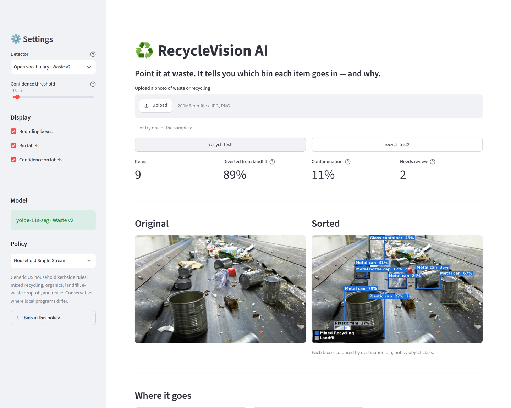

# ♻️ RecycleVision AI

**Point it at waste. It tells you which bin each item goes in — and why.**

**[▶ Try the live demo](https://recyclevision-vfhgb8vencieb6ydhtzjcw.streamlit.app/)**

RecycleVision is a computer vision system for waste sorting. The long-term goal is
real-time perception for recycling conveyor belts, and eventually for automated
robotic sorting.



> **Status:** v0.3, early but working. Runs on stock COCO weights while a
> waste-specific model is trained — see [ROADMAP.md](ROADMAP.md).

## Bins, not materials

Most waste classifiers tell you what something is made of. That is the wrong
answer, because material does not determine destination:

| Item | Material | Correct bin | Why |
| --- | --- | --- | --- |
| Wine glass | Glass | **Landfill** | Drinking glass melts at a different temperature and ruins a batch of recycled container glass. |
| Disposable coffee cup | Paper | **Landfill** | Plastic-lined; rejected by most programs. |
| Pizza slice | Organic | **Compost** | Food waste, not recycling. |
| Plastic bottle | Plastic | **Recycling** | The easy case still has to work. |

A material-first design gets the first three wrong. RecycleVision routes to bins
directly, attaches handling instructions, and flags the items where it genuinely
cannot be sure.

## Two detectors

The project ships two, and measures both. The difference is the whole story:

| | Stock COCO | Open vocabulary |
| --- | --- | --- |
| Model | YOLOv8s | YOLOE + `vocab/waste_v1.yaml` |
| Class list | Fixed at training time, 80 everyday objects | Given in words, editable in a YAML file |
| A steel can | "bowl" or "cup" | "steel food can" |
| Detection precision | 75% | **100%** |
| Routing accuracy | 33% | **92%** |

COCO has no class for a drink can — the most common item in a recycling stream —
so a COCO detector reports one as tableware and no downstream rule can undo
that. An open-vocabulary detector is told what to look for in words, so the
class list becomes configuration. `vocab/waste_v1.yaml` simply asks for
`aluminum drink can`.

Turning those words into embeddings needs a text encoder ten times the size of
the detector, so that happens once, offline, and the 40KB result is committed.
At runtime nothing but the cached embeddings is loaded — which is what keeps
the app deployable on a small host.

```bash
# Only when the vocabulary changes:
pip install -r requirements-vocab.txt
python scripts/build_vocab_embeddings.py vocab/waste_v1.yaml
```

## How it works

```
image ──▶ Detector ──▶ Detection(class, confidence, box)
             ▲
     vocab/*.yaml (open-vocabulary class prompts)
                            │
                            ▼
                     RoutingPolicy  ◀── policies/*.yaml
                            │
                            ▼
              RoutedItem(bin, handling, certainty)
                            │
                            ▼
                       SortResult ──▶ UI / CLI
```

Three swappable pieces:

- **Detector** — stock YOLOv8 today, a conveyor-trained model later. Nothing
  downstream knows the difference.
- **RoutingPolicy** — a YAML file, not code. Local recycling rules live in
  `policies/`, so a new municipality or facility is a new file rather than a
  deploy.
- **Presentation** — Streamlit and a CLI today; an HTTP API and robot control
  later, all reading the same `SortResult`.

## Quick start

```bash
git clone https://github.com/encore488/recycle_vision.git
cd recycle_vision

python -m venv .venv
source .venv/bin/activate          # Windows: .venv\Scripts\Activate.ps1

pip install -r requirements.txt
streamlit run app.py
```

No model download step: if `models/best_model.pt` is absent, stock `yolov8s.pt`
is fetched automatically on first run and the UI says clearly that it is running
in demo mode. Sample images are included, so you can try it without a photo of
your own.

## Command line

For scripting, or just to check it works without a browser:

```bash
python -m recyclevision images/recycl_test.jpg
python -m recyclevision images/*.jpg --json
python -m recyclevision images/recycl_test.jpg --save-annotated out/
```

```
images/recycl_test.jpg
  model  YOLOv8s (COCO)
  policy Household Single-Stream
  6 item(s), 33% diverted from landfill

  Mixed Recycling (2)
    - Beverage bottle  72%
        Empty and rinse. Leave the cap screwed on.
    - Beverage bottle  16%
        Empty and rinse. Leave the cap screwed on.

  Landfill (4)
    - Bowl  61%  [review]
        Scrape food residue into the organics bin first.
    - Cutlery  56%  [review]
        Metal cutlery should be kept, donated, or taken to scrap.
    - Cup  30%  [review]
        If it is a ceramic mug, keep or donate it instead.
    - Cutlery  18%  [review]
        Metal cutlery should be kept, donated, or taken to scrap.
```

Those `[review]` flags are the system working, not failing. The sample is a
photo of a real conveyor belt carrying steel cans — and **COCO has no class
for a can**, so the model reports them as "bowl", "cup" and "cutlery", which
the policy routes to landfill. Wrongly.

That is a limitation of the detector, not the routing, and it is the clearest
possible argument for training a purpose-built model — the next major
milestone. Until then the app says so on every screen rather than quietly
reporting a confident wrong answer.

## QA: grading the model

Judging a detector from one cluttered annotated image does not work — boxes
overlap, labels get displaced, and small false positives hide in the noise.
`recyclevision.qa` cuts each detection into its own captioned tile so a person
can grade them honestly:

```bash
python -m recyclevision.qa sheet images/*.jpg --out qa/
# ...grade qa/verdicts.json by hand...
python -m recyclevision.qa score qa/verdicts.json
```

Verdicts separate the two failure modes, because they have different fixes:

| Verdict | Means | Fix |
| --- | --- | --- |
| `correct` | Right object, right bin | — |
| `wrong_bin` | Real object, well localised, wrong destination | Detector or policy |
| `false_positive` | Box is not on an object at all | Detector |
| `unsure` | Cannot tell from the image | — |

### Current scores

Graded by hand over the two sample images (`qa/*/verdicts.json`):

| | COCO | Open vocab v1 | **Open vocab v2** |
| --- | --- | --- | --- |
| Detections | 9 | 14 | 15 |
| Detection precision | 75% | 100% | **100%** |
| Class accuracy | — | 62% | **85%** |
| Routing accuracy | 33% | 92% | **100%** |

**Read class accuracy before routing accuracy.** Routing accuracy flatters the
model badly: it forgives every mislabel that happens to land in the right bin,
and on v1 that was most of them. v1 scored 92% routing while naming 38% of
objects wrongly — a steel can called "aluminum drink can", a plastic bottle
called a can. The pictures looked wrong because they *were* wrong; the headline
number hid it. Class accuracy was added to the harness specifically to stop
that.

#### ⚠️ These numbers are fitted, not predicted

The v2 vocabulary was tuned *against these two images*: prompts were added,
reworded and deleted based on what they scored here. That is overfitting by
construction, and 15 detections over 2 images is a tiny sample. **Treat these
as "the mechanism works", not as an accuracy estimate.** The first honest
measurement will be the first image the vocabulary has not seen.

What is still wrong, on the images it *was* fitted to:

- A clear plastic water bottle is called a metal can, and a can end is called a
  bottle cap. Both are mislabels that route correctly, which is the best kind
  of error to have left.
- Two small fragments on the belt are graded `unsure` — too small to identify
  from the image at all.

## How the vocabulary is designed

The rule: **ask for a distinction only where it changes a bin decision.**

v1 asked the detector to separate aluminium cans from steel cans. Both go in
the same bin under every shipped policy, and a materials recovery facility
separates them mechanically downstream anyway — so the distinction bought
nothing and cost accuracy, producing the single largest source of mislabels.
v2 merges them into `metal can`.

The reverse also applies. Container glass and drinking glass *do* go to
different bins — a tumbler ruins a batch of recycled container glass — so that
split is kept and reinforced, even though both are "glass".

One prompt was deleted outright. v1's `styrofoam` fired on a sheet of paper,
sending recyclable fibre to landfill. Every replacement tested (`foam cup or
tray`, `white foam packaging`, `polystyrene foam block`) captured the same
sheet of paper, because neither validation image contains foam and the prompt
settled on the nearest pale flat object. A prompt that cannot be shown to work
is a liability rather than a gap, so it was removed rather than reworded again.

## Writing a policy

Two policies ship, and they disagree on purpose:

| | `household.yaml` | `mrf_conveyor.yaml` |
| --- | --- | --- |
| Context | A kitchen | A sorting line |
| Bins | Recycling / Organics / Reuse / Special / Landfill | Containers / Fibre / Organics / Residue |
| A detected `cup` | Landfill — it is a lined disposable cup | Containers — there is no tableware on a belt |

A policy maps detector class names onto bins. Only `bin` is required:

```yaml
name: Household Single-Stream
default: ignore          # unlisted classes are not waste, so don't count them

bins:
  - key: recycling
    name: Mixed Recycling
    color: "#1E6FD9"
    diverted: true       # false for landfill/residue; drives the diversion rate

rules:
  wine glass:
    bin: landfill
    item: Drinking glass
    material: glass
    handling: Wrap before binning if broken.
    certainty: high
    rationale: >-
      Not a container glass — it melts at a different temperature and will
      ruin a batch of recycled container glass.
```

`certainty: low` marks a route the system is not sure of. Those items are
surfaced in a review queue rather than counted silently, which is also the hook
for a future model-assisted fallback.

`default: ignore` matters more than it looks: COCO detects people, cars and
furniture constantly, and counting them as waste would corrupt every metric on
the dashboard.

## Deploying

Live at
[recyclevision.streamlit.app](https://recyclevision-vfhgb8vencieb6ydhtzjcw.streamlit.app/),
deployed from `main` on Streamlit Community Cloud.

`packages.txt` installs the system libraries `opencv-python` links against.
**These are installed when the container is built, not on every redeploy** — so
if the app was first created before `packages.txt` existed, a plain redeploy
will keep failing with `libGL.so.1: cannot open shared object file`. Use
*Manage app → Reboot app* to force a container rebuild.

`requirements.txt` pulls CPU-only torch from PyTorch's own index; the default
PyPI wheel bundles CUDA and is roughly three times the size, which matters on a
constrained builder.
Model weights download on first request, so the first page load after a cold
start is slower than subsequent ones.

## Development

```bash
pip install -r requirements-dev.txt
pytest              # 80 tests, no weights or network needed
ruff check .
ruff format .
```

The suite drives the whole pipeline through a `StubDetector`, so routing,
metrics and rendering are all testable without torch or a model download. CI
runs the same three commands.

## Project layout

```
app.py                  Streamlit UI (presentation only)
recyclevision/
  models.py             Domain types: Detection, Bin, RoutedItem, SortResult
  detector.py           Detector protocol, YOLO implementation, test stub
  policy.py             Policy loading, validation, and routing
  pipeline.py           Detect, then route
  render.py             Bin-coloured annotation
  weights.py            Custom weights if present, stock if not
  __main__.py           CLI entry point
policies/household.yaml Routing rules
tests/                  Weight-free test suite
```

## Tech stack

Python · Streamlit · Ultralytics YOLO · PyTorch · Pillow

## Roadmap

See [ROADMAP.md](ROADMAP.md). Next up: session metrics and impact accounting,
then video with object tracking and a virtual count line — the conveyor-belt
demo this is all building towards.

## License

MIT
